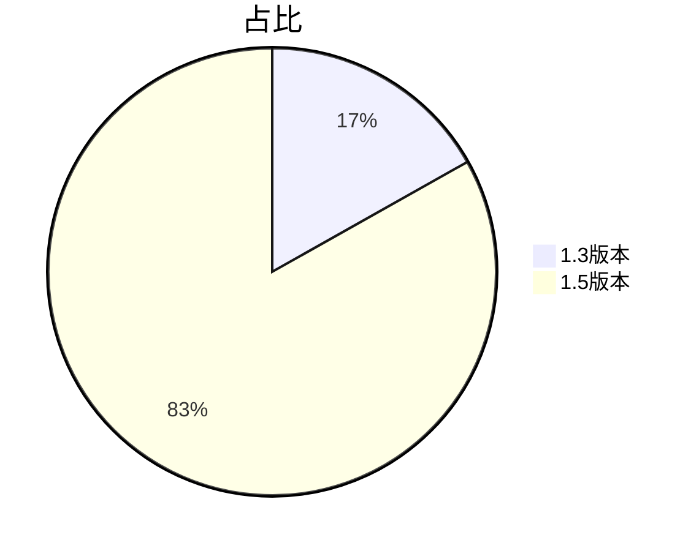

---
# try also 'default' to start simple
theme: seriph
# random image from a curated Unsplash collection by Anthony
# like them? see https://unsplash.com/collections/94734566/slidev
background: https://source.unsplash.com/collection/94734566/1920x1080
# apply any windi css classes to the current slide
class: 'text-center'
# https://sli.dev/custom/highlighters.html
highlighter: shiki
# show line numbers in code blocks
lineNumbers: false
# some information about the slides, markdown enabled
info: |
  ## Slidev Starter Template
  Presentation slides for developers.

  Learn more at [Sli.dev](https://sli.dev)
# persist drawings in exports and build
drawings:
  persist: false
# page transition
transition: fade-out
# use UnoCSS
css: unocss
---

# 述 职 报 告
It is the unforeseen that always happens.

  
    陈 龙 <carbon:arrow-right class="inline"/>
  

<!--
The last comment block of each slide will be treated as slide notes. It will be visible and editable in Presenter Mode along with the slide. [Read more in the docs](https://sli.dev/guide/syntax.html#notes)
-->

---
layout: image
image: 'bg.jpg'
---
<PageOne title="2022工作内容" />
<!--
You can have `style` tag in markdown to override the style for the current page.
Learn more: https://sli.dev/guide/syntax#embedded-styles
-->

---
layout: image
image: 'bg.jpg'
---
<PageTwo title="主要涉及模块" />
---
layout: image
image: 'bg.jpg'
---
<PageThree title="主要涉及表单" />
---
transition: slide-up
---
# 代码提交次数
|                                                    |     |                    |
| -------------------------------------------------- | --- | ------------------ |
| 1.3版本 | 277次 |
| 1.5版本 | 1369次 |

 

---
---
# 代码行数

---
---
# 代码优化情况
排除了低代码配置的影响
| 模块 | 优化量（行） |  优化率（%） |
| ------- | --- | ------- |
| 指标管理 | 2617 | 36.98% |
| 报销管理 | 8889 | 62.75% |
| 借款管理 | 1972 | 62.92% |
| 总的情况 | 13478 | 55.29% |
---
---
# 代码优化的好处
### 1.减少代码量，减少项目体积，提高运行效率
### 2.代码结构更清楚，逻辑更清晰，方便后期维护
### 3.减少bug数量以及出现bug的几率，更稳定
---
---
# 代码得到优化得益于以下2点
### 1.重构
### 2.需求相对稳定了下来
---
---
# 重构所做的主要内容
### 1.vue3取代vue2：diff算法优化-更快，更好的ts支持-更稳，Compostion API-更清晰，Tree-shaking-更轻
### 2.对业务逻辑进行梳理，重新安排代码结构：结构清晰，减少重复代码
### 3.进一步组件化
### 4.进一步函数化
---
---
# 关于组件化
### 抽取模块组件26个
### 参与开发全局组件5个
---
---
# 关于函数化
### 抽象模块方法40个
### 参与开发全局方法6个
---
---
<Page title="一点问题及建议">
<template #default>
稳定、明确的需求对代码的整体质量有明显重要的影响，建议开发过程流程化，以原型为核心和驱动，原型-设计-开发-测试-产品
降低沟通成本，减少需求扯皮的情况
对设计，可以整体把控产品的样式和美观，对开发有明显的清晰的需求参照，对测试有清晰的测试参照
</template>
</Page>
