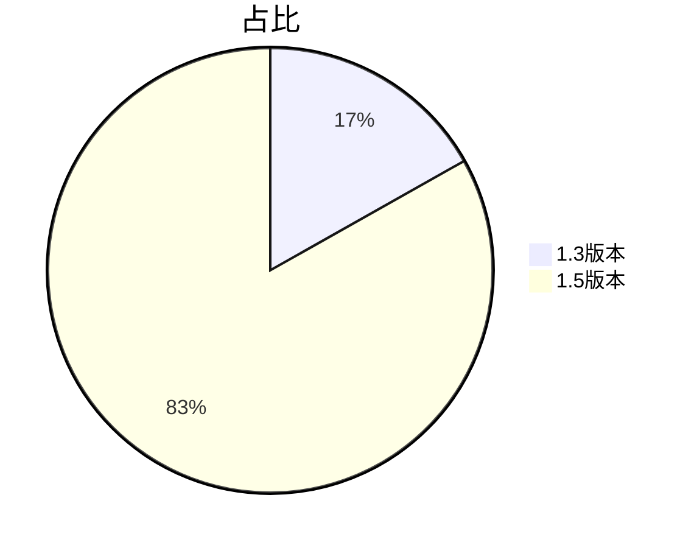
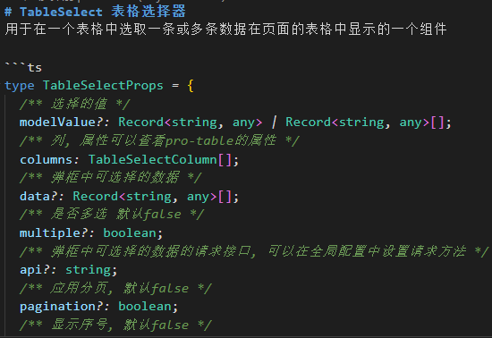
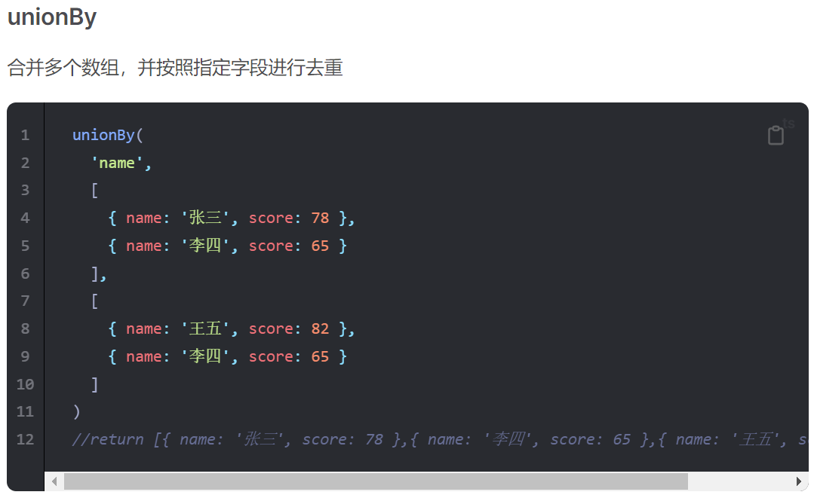

---
# try also 'default' to start simple
theme: seriph
# random image from a curated Unsplash collection by Anthony
# like them? see https://unsplash.com/collections/94734566/slidev
background: https://source.unsplash.com/collection/94734566/1920x1080
# apply any windi css classes to the current slide
class: 'text-center'
# https://sli.dev/custom/highlighters.html
highlighter: shiki
# show line numbers in code blocks
lineNumbers: false
# some information about the slides, markdown enabled
info: |
  ## Slidev Starter Template
  Presentation slides for developers.

  Learn more at [Sli.dev](https://sli.dev)
# persist drawings in exports and build
drawings:
  persist: false
# page transition
transition: fade-out
# use UnoCSS
css: unocss
---

# 述 职 报 告
It is the unforeseen that always happens.

  
    陈 龙 <carbon:arrow-right class="inline"/>
  

<!--
The last comment block of each slide will be treated as slide notes. It will be visible and editable in Presenter Mode along with the slide. [Read more in the docs](https://sli.dev/guide/syntax.html#notes)
-->

---
layout: image
image: 'bg.jpg'
---
<PageOne title="2022工作内容" />
<!--
You can have `style` tag in markdown to override the style for the current page.
Learn more: https://sli.dev/guide/syntax#embedded-styles
-->

---
layout: image
image: 'bg.jpg'
---
<PageTwo title="主要涉及模块" />
---
layout: image
image: 'bg.jpg'
---
<PageThree title="主要涉及表单" />
---
transition: slide-up
---
# 代码提交次数
期间: 2022/01/01 - 2022/12/31
|         |          |
| ------- |--------- |
| 1.3版本 | 277次 |
| 1.5版本 | 1369次 |

 

---
---
# 代码量（几个版本之间的代码行数比对）

---
---
# 代码优化情况（排除了低代码配置的影响）
代码量的急剧减少是因为进行了大量的代码优化

| 模块 | 优化量（行） |  优化率（%） |
| ------- | --- | ------- |
| 指标管理 | 2617 | 36.98% |
| 报销管理 | 8889 | 62.75% |
| 借款管理 | 1972 | 62.92% |
| 总的情况 | 13478 | 55.29% |
---
layout: image
image: 'huawen.jpg'
---
<Page title="优化代码所带来的好处">
<template #default>

<Item v-click="1" text="1.减少代码量，减少项目体积，提高运行效率" />
<Item v-click="2" text="2.代码结构更清楚，逻辑更清晰，方便后期维护" />
<Item v-click="3" text="3.减少bug数量以及出现bug的几率，更稳定" />

</template>
</Page>
---
layout: image
image: 'huawen.jpg'
---
<Page title="代码得到优化得益于以下2点">
<template #default>

<Item v-click="1" text="1.整体重构" />
<Item v-click="2" text="2.需求明确且稳定" />

</template>
</Page>
---
layout: image
image: 'huawen.jpg'
---
<Page title="重构所做的主要内容">
<template #default>

<Card v-click="1" title="vue3取代vue2">
<template #default>

diff算法优化-更快

更好的ts支持-更稳

Compostion API-更清晰

Tree-shaking-更轻

</template>
</Card>
<Card v-click="2" title="重新设计代码结构">
<template #default>

重新梳理业务逻辑，去除旧版本具有不确定性的历史代码，将业务逻辑点重新整合，使代码逻辑更清晰简洁，使代码运行更加健壮稳定

</template>
</Card>
<Card v-click="3" title="进一步组件化">
<template #default>

建立在重新设计代码结构的基础上，将业务代码分离成更小的逻辑单元，将相似、相近的逻辑单元抽离成公用的组件，进一步增加代码的可复用性、可扩展性和可维护性

</template>
</Card>
<Card v-click="4" title="进一步函数化">
<template #default>

同样建立在重新设计代码结构的基础上，将交互逻辑重新抽象，封装成公用的方法，减少代码量降低耦合度的同时，丰富了工具库

</template>
</Card>

</template>
</Page>
---
layout: image
image: 'huawen.jpg'
---
<Page title="关于组件化">
<template #default>

<Card v-click="1" title="模块公用组件">
<template #default>

封装模块级公用组件26个

例：
<Tag text="quota-select" />
<Tag text="settlement" />
<Tag text="type-dialog" />
<Tag text="steps" />
<Tag text="del-btn" />
...

</template>
</Card>
<Card v-click="2" title="全局公用组件">
<template #default>

参与开发全局公用组件5个

组件库：
例：

</template>
</Card>

</template>
</Page>
---
layout: image
image: 'huawen.jpg'
---
<Page title="关于函数化">
<template #default>

<Card v-click="1" title="模块公用方法">
<template #default>

抽象模块级公用方法40个

例：
<Tag text="useDicts" />
<Tag text="useMarkMap" />
<Tag text="useQuotaSearcher" />
<Tag text="useApplicant" />
<Tag text="Crouter" />
...

</template>
</Card>
<Card v-click="2" title="全局公用方法">
<template #default>

参与开发全局公用方法6个

工具库：
例：

</template>
</Card>

</template>
</Page>
---
layout: image
image: 'huawen.jpg'
---
<Page title="一点问题及建议">
<template #default>

从以上的过程可以看出来，
稳定、明确的需求对代码的整体质量有明显重要的影响，
建议开发过程流程化，以原型为核心和驱动，
需求的变更从原型开始，到设计到开发到测试，
降低沟通成本，减少需求扯皮的情况，
对设计，可以整体把控产品的样式和美观
对开发，有明显清晰的开发需求
对测试，有清晰的测试参照

</template>
</Page>
